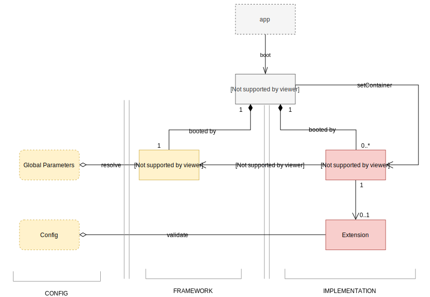

<h1>Sifodyas Documentation</h1>

Sifodyas is a light framework that helps build a module-based application.*

It works around the concept of Kernel/Bundle and Container.

The goal is not to handle your whole application and give you ways to build your vues, your app states, not any kind of network transport manager.  
It's use to give you some kind of structure to the low layer of your architecture.

## Definitions

- `Kernel` is the entry point of a Sifodyas application. It role is to load every bundles and provides them a container to use.
- `Container` can be seen as a big `Map` where services and bundles configurations are stored.
- `Compiler` is responsible of compiling the container.
- `Bundle` is a plugin, a package, or a module if you prefer. It's meant to be sandboxed at first but with a good Mediator pattern, or with an event handler system, bundles can interact with each other.
- An `Extension` of the container is provided by the bundle and is used to get and validate a configuration set exclusively for the bundle. It's also used to tweak the compiler's lifecycle. An extension is mandatory. You can skip registering it if you don't need custom configuration.

## Main workflow



In a `app.ts` (for example purpose):
```ts
import { Kernel, Bundle, ILoader } from '@sifodyas/sifodyas';

class AppBundle extends Bundle {
    public async boot() {
        // where you setup everything that you need for your bundle to work
    }

    public async shutdown() {
        // if you decide somehow to shutdown one or all you bundles
        // you can cut sockets, save stuff, or anything during this method
    }

    public getContainerExtension() {
        // where you container extension is provide
        // if you need to handle local configurations
    }
}

export class AppKernel extends Kernel {
    public registerBundles() {
        // where you load all your bundles
        return [
            new AppBundle(),
        ];
    }

    public async registerContainerConfiguration(loader: ILoader) {
        // where you load the whole config/param file of your application.
        // can be through rollup/webpack
        // or by calling a remote file
    }
}
```

Then in your `index.ts`:
```ts
import { AppKernel } from './app';

// commonly dev, prod, or test
// useful to load a different config file depending of your environment
const ENVIRONMENT = 'dev';
const DEBUG = true;
const kernel = new AppKernel(ENVIRONMENT, DEBUG);

// top level await
await kernel.boot();
```
