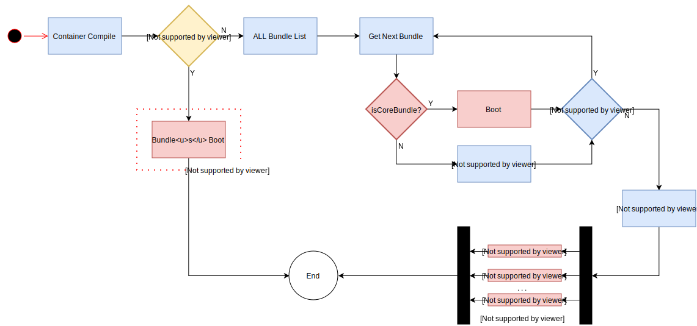

# Boot Sequence

The boot sequence is pretty straightforward. Here you can see how it works.  
When the application asks for a `Kernel.boot`, the workflow goes through some several phases.

## 0. Init `Kernel.boot`
During the first steps, the Kernel creates a Container and a Compiler and link them together. It's also there where the main config and param file name is provided.

## 1. Prepare Container
This phase is dedicated to bundles. Each ones can register its own extension and add hooks to the Container / Compiler lifecycle. Those hooks are called Compiler Passes.  
After that, the Container itself will add a Merge Config Pass that will handle the distribution of config to each bundle extensions.

## 2. Build Container
If the Kernel implements the Pass interface, it can add its own `process` method and will register itself as Pass in the Compiler.  
The Container will then load the config file.  
The parameters will be then resolved and set in the Container and each registered Extension will have to validate and get their own configuration. (see [container doc](container.md))

## 3. Compile Container
This phase will finalize the compiler and with it, the container.  
For that, the compiler will "process" each pass registered earlier.  
In order:
- mergePass, which is the Merge Config Pass
- beforeOptimizationPasses
- optimizationPasses
- beforeRemovingPasses
- removingPasses
- afterRemovingPasses

After that, the parameter bag will be finally frozen.

## 4. Real Boot
Just before finally call the `boot` method of every bundles, the Kernel will set itself as a service in the Container.

From now, depending of the parameters, or if some of the bundles are `CoreBundle`, the booting process will be either sync or async.
