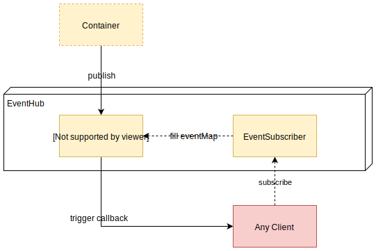

<h1>Event System</h1>

In Sifodyas, a very basic event hub is built in. This system allows you interact with kernel and other business component of your layer without having any a direct dependency to them.  
The event system is also used to be aware of many steps of the lifecycle.

Three main components are used: the `EventPublisher`, the `EventSubscriber`, and the event object implementing `IEvent`.

As it is for now, the event system is still in conception. Basic behavior is there, but the content of the event object may evolve (without breaking changes) in the future.



## `EventPublisher`
This service allows you to send events to whoever wants to listen to them. It's accessible with `event_publisher` service id.  
The whole event map is stored in this object and even it can be directly manipulated, it **only** for internal uses.

```ts
class MyBundle extends Bundle {
    public boot() {
        const eventPublisher = this.container.get('event_publisher');
        // This event is not really revelant because it will be fired only during boot phase
        // and their is a low chance that someone is already ready to listen to it.
        eventPublisher.publish('myBundle.myEvent', new MyEvent());
    }
}
```

## `EventSubscriber`
This subscriber helps you consume what is produced with the publisher. It's accessible with `event_subscriber` service id.  
You can setup a callback function like a classic emit emitter class, but you also can asynchronously iterate over each event published which can be pretty usefull in a event stream situation. But remember that `iterate` method is still experimental.

```ts
class MyBundle extends Bundle {
    public async boot() {
        const eventSubscriber = this.container.get('event_subscriber');

        const onGetParameter = (evt: ContainerEvent) => {
            console.log(evt.getState());
        }
        // classic subscribe to a container event
        eventSubscriber.subscribe('event.container.getParameter', onGetParameter);

        // you should give the same function that you used on subscribe to be able to unsubscribe. Behind the scene, your function is used as "id".
        eventSubscriber.unsubscribe('event.container.getParameter', onGetParameter);

        // iterate over each event published. On each iteration, an event is yielded.
        // this should mostly be set in a worker of some sort.
        // because the event stream is "infinite" the only way to unsubscribe is by breaking the loop.
        for await (const evt of eventSubscriber.iterate('event.container.getParameter')) {
            onGetParameter(evt);
        }
    }
}
```

## Event Object & Custom Events
As said earlier, each triggered event will have an event object associated to it. This object implements the `IEvent` interface and optionally provides a `getState()` method.  
This method is a way for the event to provide additional information.

For examples ; `KernelEvent` based events don't need more than the trigger of the event itself to give you the desired status of the Kernel. On the contrary, `ContainerEvent` based events **do** need a state because it will tell you wich parameter or service have been moved from the Container.

Multiple event id can share the same event class as long as it's relevent for the application. In any case, you should always implements the `IEvent` interface and define (again) the "namespace" of the event (preferably equivalent to the event id).

Adding autocomplete with your own events is pretty easy:
```ts
interface MyEventState {
    isActive: boolean; // for example purpose
}

class MyEvent implements IEvent<MyEventState> {
    public namespace = 'myBundle.myEvent';

    public getState() { // should return the state type defined is the generic
        return { isActive: true }
    }
}

// augmenting sifodyas to give the EventSubriscriber/EventPublisher the knowledge of **your** event
declare module '@sifodyas/sifodyas' {
    interface EventKeyType {
        'myBundle.myEvent': MyEvent;
    }
}

// somewhere in your code
container.get('event_subscriber').subsribe('myBundle.myEvent', evt => {
    console.log(evt.getState().isActive);
});
container.get('event_publisher').publish('myBundle.myEvent', new MyEvent());
// autocomplete and typechecking ok
```

You can find the list of all currently used event [here](../core/src/index.ts#L53).

## Disabling the event system
If you need to, you can disable the event system by setting the parameter `kernel.events` to false in the parameters file or by overriding the `getOverriddenParameters()` method in your Kernel.
