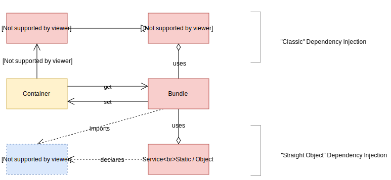
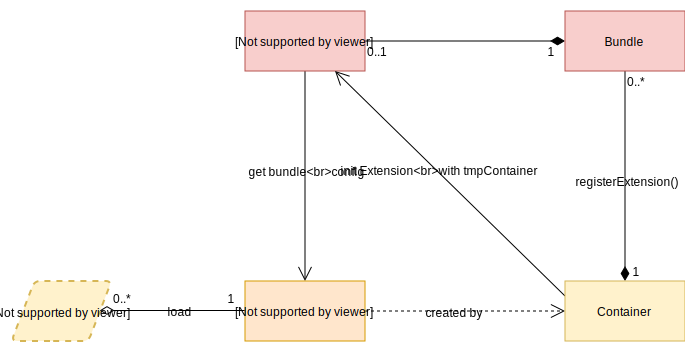

<h1>Sifodyas Documentation</h1>

Sifodyas is a light framework that helps you to build a module-based application.

It works around the concept of Kernel/Bundle and Container.

The goal is not to handle your whole application and give you ways to build your vues, your app states, nor any kind of network transport manager.  
It's used to give you some kind of structure to the low layer of your application architecture.

## Table of contents <!-- omit in toc -->
- [Definitions](#definitions)
- [Basic usage](#basic-usage)
- [Main workflow](#main-workflow)
  - [Boot sequence](#boot-sequence)
  - [Bundle.s (& Services) => Container](#bundles--services--container)
  - [Loaders](#loaders)
  - [EventSystem](#eventsystem)

## Definitions
- `Kernel` is the entry point of a Sifodyas application. It role is to load every bundle and to provide them a common container to use.
- `Container` can be seen as a big `Map` where services and bundles configurations are stored.
- `Compiler` is responsible of compiling the container.
- `Bundle` is a plugin, a package, or a module if you prefer. It's meant to be sandboxed at first but with a good Mediator pattern, or with an event system, bundles can interact with each other.
- An `Extension` of the container is provided by the bundle and is used to get and validate a configuration set exclusively for this bundle. It's also used to tweak the compiler's lifecycle. An extension is mandatory. You can skip registering it if you don't need custom configuration.

## Basic usage
In a `app.ts` (for example purpose):
```ts
import { Kernel, Bundle, ILoader } from '@sifodyas/sifodyas';

class AppBundle extends Bundle {
    public async boot() {
        // where you setup everything that you need for your bundle to work
    }

    public async shutdown() {
        // if you decide somehow to shutdown one or all your bundles
        // you can cut sockets, close databases, save stuff, or anything during this method
    }

    public getContainerExtension() {
        // where you container extension is provided
        // if you need to handle local configurations
    }
}

// main entry point
export class AppKernel extends Kernel {
    public registerBundles() {
        // where you load all your bundles
        return [
            new AppBundle(),
        ];
    }

    public async registerContainerConfiguration(loader: ILoader) {
        // where you load the whole config/param file of your application.
        // can be through rollup/webpack if you use them
        // or by calling a remote file, or even a local file in server side execution
    }
}
```

Then in your `index.ts`:
```ts
import { AppKernel } from './app';

// commonly dev, prod, or test
// useful to load a different config file depending of your environment
const ENVIRONMENT = 'dev';
// will be set as a parameter usable in every bundle
const DEBUG = true;
const kernel = new AppKernel(ENVIRONMENT, DEBUG);

// top level await if you can
await kernel.boot();
```

## Main workflow


### Boot sequence


The boot sequence is a multi step process that can be for some part sync or async.  
Check the full description [there](boot.md).

### Bundle.s (& Services) => Container



During boot, the container is sent to each bundle to make them handle their services among other things.  
You can check a deeper explaination [there](container.md).

### Loaders
TBD

### EventSystem


The event system, enabled with the `kernel.events` parameters, allows you to listen or trigger events based on an event id. The mechanism is similar to `EventEmitter` in some ways. You can subscribe with the `event_subscriber` service, and publish with the `event_publisher` service.  
Go [here](eventSystem.md) for more informations.
