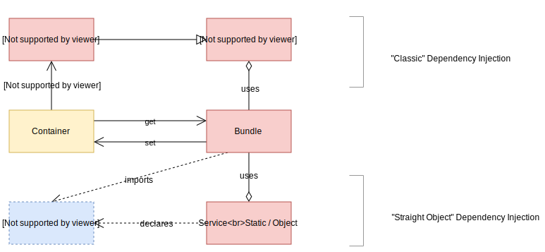
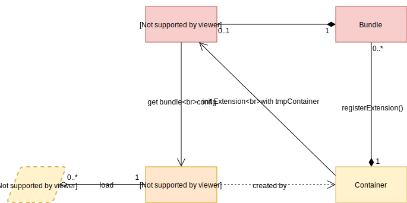

<h1>Container Mechanics</h1>

A Container can be seen as a big `Map` containing Services and configurations.  
It stores common stuff that will be shared between bundles.  
For now, a service is set manually, and conventionally during the boot phase of the Kernel or a Bundle. But you can set it anytime you have access to the container.  
Just don't forget that outside the boot method, it's up to you to handle the lifecycle of your service (when it's set, when it's get, when it's deleted, etc).  

Also, a container can have extensions. Extensions are used to validate and get a *local* configuration for a specific bundle. A bundle configuration is only accessible for *this* bundle only, and will be set under a namespace string.

## Services Worklow


### "Classic/Transient" Dependency Injection
WIP

### "Straigt Object" Dependency Injection
A "Straight Object" is basically any type of instancied object or primitive. Unlike a classic DI, Services set as straight will not be instanciated and cannot be injected with an `interface`.  
Use a `type` to type what you get from the container.

With this method, service ids are plain strings and can conventionally be name like `<bundleName>.<serviceId>`. You can for exemple set ids in an `const enum` to avoid magic strings

`FooBundle.ts`:
```ts
export type AuthorizationService = { };

const enum FooServices {
    AUTHORIZATION = 'FooBundle.authorizationService',
    VERSION = 'version',
}

class FooBundle extends Bundle {
    private static readonly VERSION = 'v1.0.0';
    public async boot() {
        const authorizationService: AuthorizationService = { /* stuff */ };
        this.container.set(FooServices.AUTHORIZATION, authorizationService);

        this.container.set(FooServices.VERSION, FooBundle.VERSION);
    }
}
```

The to retrieve it in any other class:
```ts
import { Container } from '@sifodyas/sifodyas'; // import type != import code
import { AuthorizationService, FooServices } from './FooBundle'; // import const enum != import code

class Stuff {
    constructor(container: Container) {
        const authorizationService = container.get(FooServices.AUTHORIZATION) as AuthorizationService;
    }
}
```

## Container Extension Workflow


### Extension
A bundle can provide an extension to the container. This class will be in charge of getting and validating the configuration set in the main config file (e.i. `sifodyas.config.yml`).  
By convention, the classname should be `<bundlePrefixName>Extension` (e.g. if your bundle is `FooBundle`, then the extension is `FooExtension`).  
It also can be hooked to the container's lifecycles to help you modify or extract data during the compilation process.

#### Handling configuration
In you config file (can be named `sifodyas.config.yml` for example):
```yml
foo: # this is the namespace of your bundle
  url: http://sifodyas.com
```

Then your extension:
```ts
import { Container, Extension, IConfiguration } from '@sifodyas/sifodyas';
import { Configuration } from './Configuration';

// define an interface to type you configuration
export interface FooConfiguration {
    url?: string;
}

export class Configuration implements IConfiguration {
    private config: FooConfiguration = {};

    public validateConfig<T extends FooConfiguration>(config: T): T {
        // clone it
        const raw = { ...config };

        // validate what you need
        if (typeof raw?.url !== 'string' || !raw.url.startsWith('http')) {
            throw new Error('The key "url" in FooBundle configuration should be string.');
        }

        // then return it as proof of you validation
        return raw;
    }
}

export class FooExtension extends Extension {
    private configuration: Configuration;

    public getConfiguration() {
        // this is where you setup your configuration object that will validate what you need
        return (this.configuration = this.configuration || new Configuration());
    }

    public async load(configs: Map<string, any>, container: Container) {

        const cfg = this.getConfiguration();
        const config = this.processConfiguration(cfg, configs);

        this.configuration.setConfig(config);

        // TODO: doc on additional config (from bundle itself) loaded here
    }

    public getAlias() {
        return 'foo';
    }
}
```
